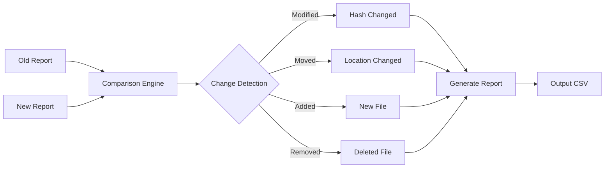

# **Advanced Usage**

## **Basic Concepts**

Before diving into advanced features, make sure you're familiar with the basic functionality:

- [Basic Directory Scanning](basic.md#basic-directory-scan) - Simple directory scanning
- [Hash Algorithm Selection](basic.md#scan-with-specific-hash-algorithm) - Choosing hash algorithms
- [File Type Filtering](basic.md#filter-by-file-type) - Basic file filtering
- [Output Format Selection](basic.md#generate-multiple-formats) - Basic report formats
- [File Listing](basic.md#file-listing) - Basic file listing functionality
- [Report Viewing](basic.md#viewing-reports) - Basic report viewing
- [Basic Report Comparison](basic.md#comparing-reports) - Simple report comparison

### **Memory Management**

Control memory usage through various settings:

```toml
# settings.toml
[hashreport]
# Resource monitoring settings
memory_threshold = 0.85  # % of total memory
mmap_threshold = 10485760  # 10MB - Use mmap for files larger than this
chunk_size = 4096  # bytes
```

### **Thread Configuration**

Optimize thread usage for your system:

```toml
# settings.toml
[hashreport]
# Thread pool settings
min_workers = 2
batch_size = 1000
max_retries = 3
retry_delay = 1.0
resource_check_interval = 1.0  # seconds
```

### **Performance Tuning**

Fine-tune performance settings:

```toml
# settings.toml
[hashreport.progress]
refresh_rate = 0.1
show_eta = true
show_file_names = true
show_speed = true
```

## **Input Validation and Sanitization**

hashreport implements robust input validation and sanitization to ensure safe operation.

### **Path Validation**

- Absolute and relative paths are supported
- Path traversal attempts are blocked
- Special characters are properly escaped
- Unicode paths are handled correctly

### **Pattern Validation**

- Glob patterns are validated for syntax
- Regular expressions are checked for validity
- Pattern length is limited to prevent DoS
- Special characters are properly escaped

### **Size Validation**

- File size limits are enforced
- Memory limits are respected
- Buffer sizes are validated
- Chunk sizes are checked

## **Email Notifications**

hashreport can email reports upon completion using SMTP.

### **Basic Email Setup**

```bash
hashreport scan /path/to/directory \
  --email recipient@example.com \
  --smtp-host smtp.example.com \
  --smtp-user username \
  --smtp-password password
```

### **Security Best Practices**

1. **Use Environment Variables**
   ```bash
   export HASHREPORT_SMTP_HOST=smtp.example.com
   export HASHREPORT_SMTP_USER=username
   export HASHREPORT_SMTP_PASSWORD=password
   ```

2. **Use App Passwords**
   - For Gmail, use App Passwords instead of account passwords
   - Generate at: Google Account → Security → 2-Step Verification → App passwords

3. **Use TLS/SSL**
   ```bash
   hashreport scan /path/to/directory \
     --email recipient@example.com \
     --smtp-host smtp.example.com \
     --smtp-port 587 \
     --smtp-tls
   ```

4. **Secure Configuration File**
   ```toml
   # settings.toml
   [hashreport.email_defaults]
   port = 587
   use_tls = true
   host = "smtp.example.com"
   timeout = 30
   default_subject = "HashReport Results"
   retry_attempts = 3
   ```

### **Testing Email Configuration**

Test your email settings without processing files:

```bash
hashreport scan /path/to/directory \
  --email recipient@example.com \
  --smtp-host smtp.example.com \
  --smtp-user username \
  --smtp-password password \
  --test-email
```

### **Gmail Example**

Using Gmail's SMTP server:

```bash
hashreport scan /path/to/directory \
  --email recipient@gmail.com \
  --smtp-host smtp.gmail.com \
  --smtp-port 587 \
  --smtp-user your.email@gmail.com \
  --smtp-password "your-app-password"
```

## **Pattern Matching**

### **Glob Patterns**

Use glob patterns to match files:

```bash
# Match all PDF files
hashreport scan --include "*.pdf" /path/to/directory

# Match specific file types
hashreport scan --include "*.{jpg,png,gif}" /path/to/directory

# Exclude temporary files
hashreport scan --exclude "*.tmp" /path/to/directory
```

### **Regular Expressions**

Use regular expressions for more complex patterns:

```bash
# Match files with date in name
hashreport scan --regex --include ".*\d{8}.*" /path/to/directory

# Match specific file extensions
hashreport scan --regex \
  --include ".*\.(jpg|png)$" \
  --exclude "thumb.*\.jpg$" \
  /path/to/directory
```

### **Filelist with Patterns**

The filelist command supports the same pattern matching:

```bash
# List all PDF files
hashreport filelist --include "*.pdf" /path/to/directory

# List files with regex
hashreport filelist --regex --include ".*\d{8}.*" /path/to/directory
```

## **Report Generation**

### **Report Formats**

hashreport supports multiple report formats:

```bash
# Generate CSV report (default)
hashreport scan -f csv /path/to/directory

# Generate JSON report
hashreport scan -f json /path/to/directory

# Generate both formats
hashreport scan -f csv -f json /path/to/directory
```

### **Report Configuration**

Configure report generation behavior:

```toml
# settings.toml
[hashreport.reports]
include_metadata = true
include_timing = true
max_concurrent_writes = 4
compression = false
```

### **Custom Report Names**

Control report filenames:

```bash
# Custom named reports
hashreport scan /path/to/directory -o custom_report.csv

# Multiple formats with custom names
hashreport scan /path/to/directory \
  -o report.csv \
  -f csv -f json
```

## **Report Comparison**

### **Understanding Changes**

The comparison functionality identifies several types of changes:

- **Modified**: File exists in both reports but has different hash values
- **Moved**: Same file (identical hash) exists in different locations
- **Added**: File exists only in the newer report
- **Removed**: File exists only in the older report



### **Output Format**

Changes are displayed with bold text for better visibility:

- Change type is displayed in **bold**
- File paths show the original and new locations
- Details include hash values and change descriptions
- Complete path information is shown in separate columns

### **Saving Comparisons**

Comparison results can be saved to CSV format:

```bash
hashreport compare old_report.csv new_report.csv -o /path/to/output/
```

The output filename will be generated automatically using the format:
`compare_<old_report>_<new_report>.csv`

### **Using with Version Control**

Example workflow for tracking file changes:

```bash
# Generate initial report
hashreport scan /path/to/project -o initial_report.csv

# Make changes to files
git add .
git commit -m "Update project files"

# Generate new report
hashreport scan /path/to/project -o new_report.csv

# Compare reports
hashreport compare initial_report.csv new_report.csv
```

For more information, see:
- [Basic Usage](basic.md)
- [Command Reference](commands.md)
- [Configuration Guide](configuration.md)
- [Troubleshooting](troubleshooting.md)
